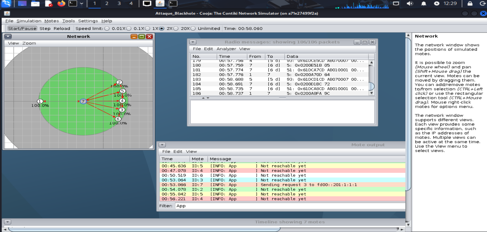

````markdown
#  IoT RPL Blackhole Attack Simulation 

**A network security research project demonstrating a Blackhole attack on an IPv6 Mesh Network (6LoWPAN) running the RPL routing protocol.** ## 📌 Overview
This project simulates an Internet of Things (IoT) environment to analyze the vulnerabilities of the **RPL** (IPv6 Routing Protocol for Low-Power and Lossy Networks). 

A malicious node is introduced into a healthy mesh network to perform a **Blackhole routing attack**: it manipulates the **DODAG Information Object (DIO)** messages to spoof a fake, highly advantageous routing rank (e.g., rank 128). Once it successfully hijacks the DODAG tree and attracts the surrounding traffic, it silently drops all packets instead of relaying them to the root server.

##  Architecture & Tools
* **Environment:** Contiki-NG OS running inside a Docker container.
* **Simulator:** Cooja IoT emulator.
* **Nodes:** Programmed in C (Standard `udp-server` and modified `udp-client` for the malicious node).
* **Analysis:** PCAP traffic interception and analysis using Wireshark to visualize the collapse of the Packet Delivery Ratio (PDR).

##  Repository Structure
* **`malicious.c`**: The source code for the attacker node (modified rank logic).
* **`simu.csc`**: The Cooja simulation file (topology and configurations).
* **`sauvetage_attaque.pcap`**: Network capture showing the packet loss during the attack.
* **`udp-client.c` / `udp-server.c`**: Standard Contiki-NG communication nodes.

##  Quick Start
### Prerequisites
Run the official Contiki-NG Docker image with X11 forwarding for the GUI:
```bash
sudo docker run --privileged --sysctl net.ipv6.conf.all.disable_ipv6=0 \
  --mount type=bind,source="$(pwd)",destination=/home/user/contiki-ng \
  -e DISPLAY=$DISPLAY \
  -v /tmp/.X11-unix:/tmp/.X11-unix \
  -ti contiker/contiki-ng
````

Inside the container, navigate to the project folder and launch the simulation:

```bash
cooja
```

-----

###  Simulation Architecture

-----

*Disclaimer: This project was created for educational purposes to study IoT routing security vulnerabilities.*
